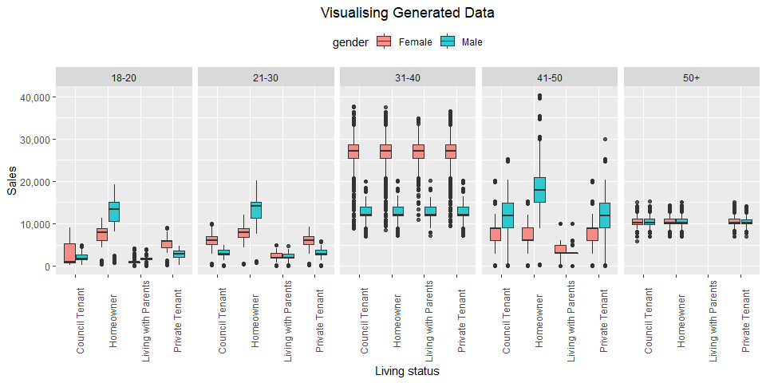

Simulating Data
================
registea
23/07/2020

<center>


</center>

# Introduction

To apply analytics and data science principles, it is necessary to have
access to data. There are many places where data is freely available,
some examples are:

  - Kaggle
  - Wiki
  - Data.gov

There are instances where open source doesn’t meet your precise data
needs. In these scenarios, it could be the perfect opportunity to
generate synthetic data, which can be built and structured to your exact
requirements.

This post is going to use base R with a little help from the tidyverse,
to demonstrate how a simple customer dataset can be generated. R
provides access to popular theoretical probability distributions and
allows us to sample values from them. Further to this, there is also
functionality to sample from an empirical distribution. Utilising these
two types of distributions, makes it very easy to generate data.

In this notebook, a dataset will be generated for 1 million customers.
For each customer, data will be created to represent socio-demographics
and sales information.

# Generating data

The first step is to specify how many customers we want to have in our
dataset. We will create 1 million customers in our dataset which will be
denoted by the object n.

``` r
# Number of customers
n <- 1000000
```

An empty dataframe is created with a single field created representing a
customer id.

``` r
# Create a dataframe
df_customer <- 
  data.frame(customer_id = 1:n)
```

The next step is to simulate the age and gender of each customer.

  - Age: It is assumed that customer’s age follows a normal distribution
    with a mean age of 35 years old and a standard deviation of 10 years
    old. An additional condition is added to ensure that customers are
    at least 18 years old, a uniform sample is taken, changing any
    estimated age that is below 18 to be between 18 and 29
  - Gender: Using the sample function, I randomly assign customers as
    male or female with a distribution split of 45% and 55% respectively

<!-- end list -->

``` r
# Customer Age
df_customer$age <- round(rnorm(n, 35, 10), 0)
df_customer$age <- ifelse(df_customer$age < 18, sample(18:29, 1), df_customer$age)

# Customer gender
df_customer$gender <- sample(c('Male','Female'), size = n, prob = c(0.45, 0.55), replace = T)
```

The next fields to be populated relate to the customer’s marital status,
the number of children they have and their living status. These new
variables will all be conditioned on the customer’s age. As an example,
it has been assumed that customers under 30 have a 69% probability of
being single, compared to customers over 50 having a 80% probability of
being married. Categorical variables ‘marital status’ and ‘living
status’ are generated by sampling from categorical vectors with
specific probabilities of occurrence. The number of children that a
customer has is assumed to follow a poisson distribution with different
lambda rates based the customer’s age.

``` r
# marital status
df_customer <-    
  mutate(df_customer, 
         marital_status = sapply(age, function(age) {
           case_when(
             age <= 30 ~ sample(c('Cohabiting','Married', 'Other', 'Single'), 
                                size = 1, 
                                prob = c(0.2, 0.1, 0.01, 0.69), 
                                replace = T),
             age <= 40 ~ sample(c('Cohabiting','Married', 'Other', 'Single'), 
                                size = 1, 
                                prob = c(0.4, 0.1, 0.01, 0.49), 
                                replace = T),
             age <= 50 ~ sample(c('Cohabiting','Married', 'Other', 'Single'), 
                                size = 1, 
                                prob = c(0.5, 0.4, 0.01, 0.29), 
                                replace = T),
             TRUE ~ sample(c('Cohabiting','Married', 'Other', 'Single'), 
                           size = 1, 
                           prob = c(0.09, 0.8, 0.01, 0.1),
                           replace = T)
             )}))


# No of children
df_customer <-    
  mutate(df_customer, 
         no_children = sapply(age, function(age) {
           case_when(
             age <= 20 ~ round(mean(rpois(n = 10, lambda = 0)), 0),
             age <= 30 ~ round(mean(rpois(n = 10, lambda = 1)), 0),
             age <= 40 ~ round(mean(rpois(n = 10, lambda = 2)), 0),
             age <= 50 ~ round(mean(rpois(n = 10, lambda = 2)), 0),
             TRUE ~ round(mean(rpois(n = 1, lambda = 3)), 0)
             )}))

# Living status
df_customer <-    
  mutate(df_customer, 
         living_status = sapply(age, function(age) {
           case_when(
             age <= 20 ~ sample(c('Living with Parents', 'Private Tenant', 'Council Tenant', 'Homeowner'), 
                                size = 1, 
                                prob = c(0.9, 0.01, 0.08, 0.01), 
                                replace = T),             
             age <= 30 ~ sample(c('Living with Parents', 'Private Tenant', 'Council Tenant', 'Homeowner'), 
                                size = 1, 
                                prob = c(0.6, 0.1, 0.1, 0.2), 
                                replace = T),
             age <= 40 ~ sample(c('Living with Parents', 'Private Tenant', 'Council Tenant', 'Homeowner'), 
                                size = 1, 
                                prob = c(0.01, 0.33, 0.33, 0.33), 
                                replace = T),
             age <= 50 ~ sample(c('Living with Parents', 'Private Tenant', 'Council Tenant', 'Homeowner'), 
                                size = 1, 
                                prob = c(0.01, 0.33, 0.33, 0.33), 
                                replace = T),
             TRUE ~ sample(c('Living with Parents', 'Private Tenant', 'Council Tenant', 'Homeowner'), 
                           size = 1, 
                           prob = c(0.0, 0.1, 0.15, 0.75),
                           replace = T)
             )}))
```

After creating information about the customer and their families, it is
time to think about how customer’s interact with our fake business. This
will be kicked off with tenure, which will be the number of years the
customer has been registered with the company. It is assumed that the
customer’s tenure can be modelled using a poisson distribution, but
there are different underlying rates for different demographics.

``` r
# Tenure
df_customer <-    
  mutate(df_customer, 
         tenure = mapply(function(age, gender)
           {
             case_when(
               age <= 20 ~ mean(rpois(n = 10, lambda = 0.5)),
               age <= 30 & gender == "Female" ~ mean(rpois(n = 10, lambda = 5)),
               age <= 30 & gender == "Male" ~ mean(rpois(n = 10, lambda = 3)),
               age <= 40 & gender == "Female" ~ mean(rpois(n = 10, lambda = 7)),
               age <= 40 & gender == "Male" ~ mean(rpois(n = 10, lambda = 9)),
               age <= 50  & gender == "Female" ~ mean(rpois(n = 10, lambda = 3)),
               age <= 50  & gender == "Male" ~ mean(rpois(n = 10, lambda = 1)),
               TRUE ~ mean(rpois(n = 10, lambda = 2))
               )
           }, age, gender))
```

Using the same methodology as described above, lifetime sales and visits
will also be generated for each customer. Using the same concept of
sampling and conditioning, sales and visits are generated differently
for different members of the customer base. The code has been hidden as
it is slightly repetitive but can be viewed on my
[github](https://github.com/registea/generating_synthetic_data/blob/master/generating_synthetic_data.rmd).

# Summary Analysis

Now that a dataset has been created, we can take a peek at the first 20
rows to get a feel for the data.

| customer\_id | age | gender | marital\_status | no\_children |   living\_status    | tenure | visits |  sales  |
| :----------: | :-: | :----: | :-------------: | :----------: | :-----------------: | :----: | :----: | :-----: |
|      1       | 30  |  Male  |     Single      |      1       |   Private Tenant    |  2.0   |   3    | 2809.8  |
|      2       | 29  |  Male  |     Single      |      1       | Living with Parents |  3.0   |   3    | 2779.8  |
|      3       | 36  | Female |     Single      |      2       |   Council Tenant    |  8.4   |   19   | 28872.4 |
|      4       | 44  |  Male  |   Cohabiting    |      1       |   Council Tenant    |  0.7   |   5    | 15023.0 |
|      5       | 26  | Female |     Single      |      1       |      Homeowner      |  4.6   |   10   | 10038.0 |
|      6       | 33  | Female |   Cohabiting    |      2       |   Private Tenant    |  7.2   |   17   | 25459.2 |
|      7       | 46  | Female |     Single      |      2       |      Homeowner      |  3.2   |   2    | 10053.0 |
|      8       | 27  |  Male  |     Single      |      1       | Living with Parents |  2.4   |   3    | 2847.3  |
|      9       | 24  | Female |     Single      |      1       | Living with Parents |  5.5   |   2    | 1999.4  |
|      10      | 48  | Female |     Single      |      2       |   Private Tenant    |  2.5   |   3    | 14943.9 |
|      11      | 22  |  Male  |   Cohabiting    |      1       |      Homeowner      |  2.4   |   15   | 10545.0 |
|      12      | 32  |  Male  |   Cohabiting    |      2       |      Homeowner      |  10.3  |   7    | 13954.5 |
|      13      | 37  | Female |     Single      |      3       |      Homeowner      |  7.5   |   18   | 21778.2 |
|      14      | 28  |  Male  |     Single      |      1       |   Private Tenant    |  3.4   |   3    | 2866.2  |
|      15      | 24  | Female |     Single      |      1       | Living with Parents |  5.3   |   2    | 2015.0  |
|      16      | 25  | Female |   Cohabiting    |      1       | Living with Parents |  4.4   |   2    | 1498.8  |
|      17      | 47  | Female |   Cohabiting    |      1       |   Private Tenant    |  3.0   |   3    | 8925.9  |
|      18      | 48  |  Male  |     Single      |      2       |   Private Tenant    |  0.8   |   3    | 15022.8 |
|      19      | 39  | Female |   Cohabiting    |      2       |   Council Tenant    |  7.2   |   17   | 25528.9 |
|      20      | 31  |  Male  |     Single      |      2       |   Council Tenant    |  8.2   |   7    | 13976.9 |

From the print out above we can see a diverse distribution of data
within each field indicating the generation has worked as expected. This
is further visualised in the plot below which visualises the sales data
across multiple customer attributes. We can see that some potentially
realistic distributions in the data are reflected across different
customer cohorts based on age, gender and living\_status.

<!-- -->

# Conclusion

This was a simple example of how data can be generated with underlying
patterns of varying complexity. The principle and the code is relatively
simple and can be used to generate a variety of datasets of different
sizes for different purposes. It is likely these principles will be used
in my upcoming projects.
